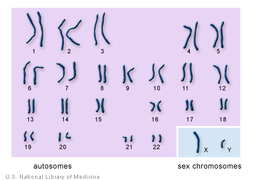
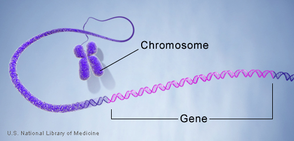

# SQL assessment
For this assessment you will use a mouse genome database.

### Background on genomes
A **genome** is the entirety of unique genetic information in an organism. Genomes can be grouped at many different levels. **Chromosomes** are the highest level. In mice there are 23 chromosomes: 1-20, X, Y, and MT. 

  

 

From the image above you can see that chromosomes are not all the same size and come in pairs. Chromosomes are composed of **basepairs (bp)**, which are one of the smallest functional pieces and are the unit of measurement for length. Within chromosomes there are **genes**. Genes occupy small regions of a chromosome and have defined start and stop points. It is possible for genes to overlap each other, and multiple genes can have the same start or stop point (but not both). Additionally, genes are not always directly next to each other, there can be gaps between them. There are different varieties of genes, such as `protein-coding`, `tRNA`, and many others.

  

  

Genes can be grouped based on function. These groups are called **taxonomic groups** and are identified as `tax_id` in the database. Genes that are functionally related aren't always clustered together. 

In this database, genes have both a name (found in the `symbol` column) and an id (found in the `gene_id` column).

## Data
Download the database backup file from https://drive.google.com/file/d/1NjEiVXM3QSpunv7nlbTFhFiWulMiEP5y/view?usp=sharing. Create a database named `mouse_genome` on your PostreSQL Server.
Right-click on the empty database and choose the `Restore` option. Navigate to the `mouse_genome.backup` file by clicking on the ellipsis (`...`). Leave the defaults for all other options.

## Questions
_Report your answers as comments within the .sql file under your query_

1. Using the gene_info table:  
  a. How many genes are on each chromosome?  
  b. How many genes are protein-coding on each chromosome?  
  c. What is the average length of _all_ protein coding genes across the entire mouse genome? Hint: you will have to `JOIN` gene_info with another table.

2. What is the mean, min, and max number of genes in a `tax_id`? Be sure to use the `gene_group` table.

3. What are the longest and shortest genes?  
  a. Exclude any gene that has the same `start_position` and `end_position`  
  b. Be sure to include the gene name (`symbol`) in the output  
  c. Return the result as a single table  
  d. If there is a tie, only take 1 gene

4. Some genes are close together in clusters on a chromosome. You can see if genes are part of a cluster by examining whether there are genes on the left and/or right. Create a label for the genes on chromosome 1 to identify each gene's position in a cluster:  
  a. Label genes that are _"isolated"_, at the _"beginning"_ of a cluster, _"middle"_ of a cluster, or _"end"_ of a cluster  
  b. Filter out genes whose names start with "LOC"  
  c. Return **only** the first 100 _"end"_ genes on the chromosome (Hint: sort by `start_position` ascending)  
  d. Your output should have the columns `symbol`, `gene_id`, `chromosome`, `start_position`, and the label that was assigned  

5. Genes are not always right next to each other. Many times there are gaps between them. But you can still tell how far away a gene's nearest neighbors are. With this in mind, find genes that are less than 100bp away from both the gene on the right and the gene on the left. Then count the number of times this organization occurs within each `tax_id`. Return **only** the top 100 `tax_id`s based on the count.

### Future practice to work through:

6. Genes can also be grouped according to whether they are related (originated from the same older gene). These related genes are called **orthologs**. Two closely related genes are orthologs of each other, meaning that _Gene A_ is an ortholog of _Gene B_ and vice versa. Which gene or genes has the most number of orthologs?  
  a. Remove genes that start with "LOC" from both the gene and the ortholog  
  b. Be sure to remove duplicate gene names (ignore case)  

7. Find genes that don't have any genes on the left or right, but instead have other genes with the same start_position. Your output should return each pair of gene_names (symbol) that have the same starting point (3 genes that have the same starting point would result in 3 rows, one for each unique pair of genes). Which chromosome(s) are these on? Do any of the gene pairs have the same length?

8. For each 10000 basepairs on chromosome 1, count the number of genes that start within that region. Export that output and make a visualization showing the count of per 100000 basepairs. HINT: Use the width_bucket function (https://www.postgresql.org/docs/9.1/functions-math.html). You may need to write a series of queries to generate the values to be used in the function

## Data Dictionary
|gene_orthologs|Pairs of genes that are related by function and origin|
|---|---|
|`tax_id`|ID that identifies the group the FIRST gene belongs to|
|`gene_id`|ID for the FIRST gene in the pair|
|`Relationship`|How genes in pair are related, always "Ortholog"|
|`other_tax_id`|ID that identifies the group the SECOND gene belongs to|
|`other_gene_id`|ID for the SECOND gene in the pair|
	
|gene_neighbors|Describes how genes are organizationally related to other genes on the same chromosome|
|---|---|
|`tax_id`|ID that identifies the group the gene belongs to|
|`gene_id`|ID of the gene|
|`genomic_accession`|Another ID similar to tax_id|
|`genomic_gi`|Another ID similar to tax_id|
|`start_position`|The location where the gene starts on the chromosome, given in basepairs (bp)|
|`end_position`|The location where the gene ends on the chromosome, given in basepairs (bp)|
|`Orientation`|Whether a gene runs forwards or backwards along a chromosome (based on which strand of DNA the gene is on)
|`Chromosome`|Chromosome the gene is on|
|`gene_ids_on_left`|The IDs of the genes to the left of the gene within a certain distance|
|`distance_to_left`|The distance to the closest gene on the left|
|`gene_ids_on_right`|The IDs of the genes to the right of the gene within a certain distance|
|`distance_to_right`|The distance to the closest gene on the right|
|`overlapping_gene_ids`|IDs of genes that overlap, completely or partially, with the current| gene
|`Assembly`|Where the gene was mapped|
	
|gene_info|Naming, location, function, and other information for gene|
|---|---|
|`tax_id`|ID that identifies the group the gene belongs to|
|`gene_id`|ID of the gene|
|`Symbol`|Name of the gene|
|`locus_tag`|Identifier for the location in the genome|
|`Synonyms`|Other names associated with the gene|
|`dbx_refs`|Other reference IDs for connecting with other databases|
|`Chromosome`|Chromosome the gene is on|
|`map_location`|Different measure of location, size, and distance (measured in Angstroms and| centimorgans)
|`type_of_gene`|Category of the gene, 12 different categories, including "unkown"|
|`symbol_from_nomenclature_authority`|Official name of gene, not typically used|
|`full_name_from_nomenclature_authority`|Official full name of gene, not typically used|
|`nomenclature_status`|Status of gene naming|
|`modification_date`|Date of latest change (yyyymmdd)|
|`feture_type`|Broad group based on gene function|
	
|gene_group|pairs of genes that related by location|
|---|---|
|`tax_id`|ID that identifies the group the FIRST gene belongs to|
|`gene_id`|ID for the FIRST gene in the pair|
|`Relationship`|How genes in a pair are related, 8 different labels|
|`other_tax_id`|ID that identifies the group the SECOND gene belongs to|
|`other_gene_id`|ID for the SECOND gene in the pair|

